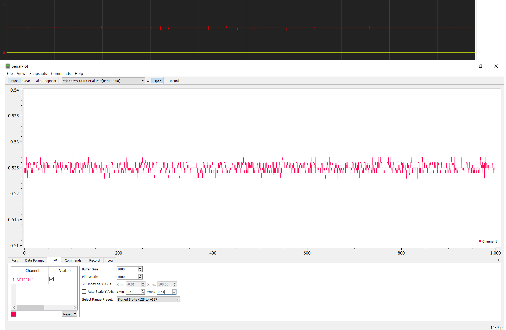

# zedboard_serial_oscilloscope_concept
Zedboard XADC external voltage measurement and serial plotting with laptop

The idea of the project is to measure an external voltage and plot it in laptop with a serial plotter-program.
Current is conversed to voltage and amplified.
Project demonstrates how to use Zedboard and laptop as a simple oscilloscope.

